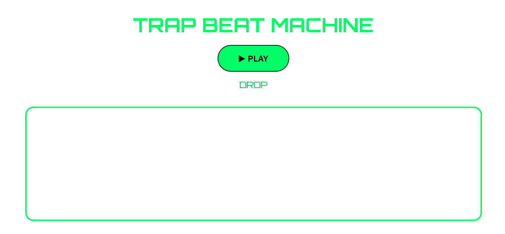

# 🎵 Trap Beat Machine

> A browser-based Trap Beat Machine built entirely with JavaScript and Tone.js — no audio files, no DAWs, just code generating real music in real time.



---

## ✨ What Makes This Different

- 🚫 No MP3 files
- 🚫 No WAV samples
- 🚫 No FL Studio / Ableton
- ✅ 100% synthesized sound, generated live in the browser using the Web Audio API

---

## 🚀 Features

- 🎹 Real-time trap beat generation
- 🔄 Dynamic section changes — Intro → Verse → Hook → Drop
- 🎼 Chord progression system
- 🥁 Kick drum synthesis
- 🪘 Snare synthesis
- 🎩 Hi-hat synthesis
- 📊 FFT audio visualizer
- ▶️ Play / Stop controls
- 📱 Responsive UI
- ⚙️ Built using Tone.js

---

## 🛠 Tech Stack

| Layer | Technology |
|---|---|
| Markup | HTML5 |
| Styling | CSS3 |
| Logic | JavaScript |
| Audio Engine | Tone.js + Web Audio API |
| Visuals | Canvas API |

---

## 🎼 Instruments

| Instrument | Role | Powered By |
|---|---|---|
| PolySynth | Melodic chords | Sawtooth oscillator |
| MembraneSynth | Kick drum | Synthesized envelope |
| NoiseSynth | Snare | White noise shaping |
| MetalSynth | Hi-hats | FM synthesis |

---

## 🎚 Arrangement

The beat automatically evolves through 4 sections, switching every few measures so the track never feels static:

1. **INTRO**
2. **VERSE**
3. **HOOK**
4. **DROP**

---

## 📊 Audio Visualizer

A real-time FFT spectrum visualizer renders live frequency data straight from `Tone.Analyser` onto an HTML5 `<canvas>` — synced perfectly with the beat as it plays.

---

## ⚡ How It Works

1. All sounds are **synthesized**, not sampled — generated directly inside the browser using Tone.js.
2. Playback timing is handled by `Tone.Transport`, keeping every instrument perfectly in sync.
3. `Tone.Analyser` extracts live frequency data, which is rendered to canvas in real time as the visualizer.

No audio files are loaded at any point. The "instruments" are pure math and oscillators.

---

## 📦 Installation

Clone the repository:
```bash
git clone https://github.com/Siven26-coding/code-generated-music.git
```

Move into the project folder:
```bash
cd code-generated-music
```

Run it:
- Open `index.html` directly in your browser, **or**
- Use the **Live Server** extension in VS Code for the best experience

---

## 🗺 Roadmap

- [ ] Multiple drum patterns
- [ ] Tempo / BPM controls
- [ ] Step sequencer
- [ ] Bass synthesizer
- [ ] Piano roll editor
- [ ] Dark mode
- [ ] Export generated audio
- [ ] Save custom patterns

---

## 🤝 Contributing

Pull requests are welcome! Got an idea for a new pattern, instrument, or feature? Fork the repo, build it, and send a PR.

---

## 📄 License

This project is open source and available under the MIT License.

---

## 👨‍💻 Built With ❤️ By

**Siven Kanojiya**

🔗 GitHub: [Siven26-coding](https://github.com/Siven26-coding)

---

⭐ If you liked this project, drop a star on the repo — it helps a lot!
